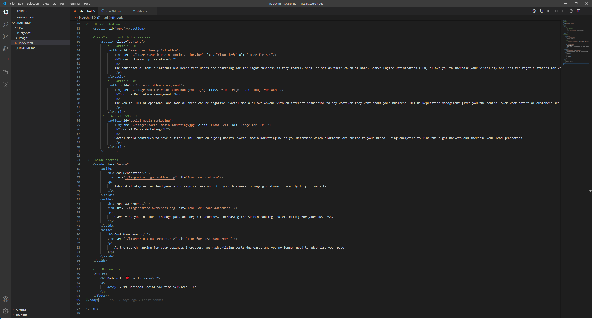

<<<<<<< HEAD
# Weekly Challenge 1
## Description
=======
#Weekly Challenge 1
#Description
>>>>>>> e44581d0d857f93d7721af4a3894aae8acd9862c
This is a website for Horiseon. Its done as part of the weekly challenge in coding bootcamp at UC Berkeley. The objective of this project is to Refactored the code to meet acceptance criteria and also to included appropriate comments, closing tags and alternative texts for images. 
#Live URL
Please find the website deployed [here] (https://vsjanarthani.github.io/Challenge1/)
## Built With
*HTML
*CSS
## Screenshot

<<<<<<< HEAD
## Contribution
Made with :heart: by **Janarthani V Subramaniam**
=======
#Contribution
Made with <3 by Janarthani V Subramaniam
>>>>>>> e44581d0d857f93d7721af4a3894aae8acd9862c
